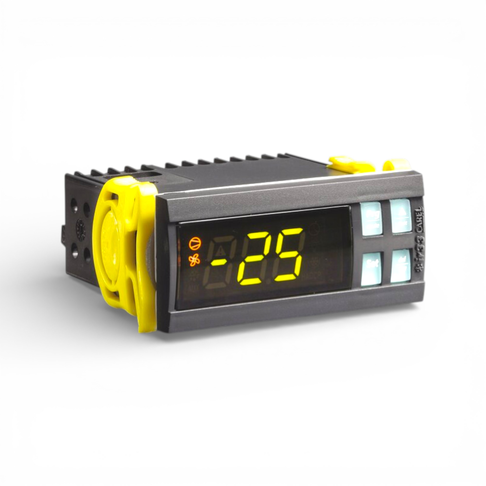
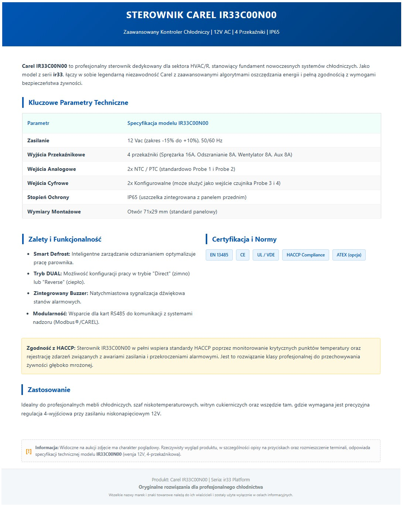

# Case Study: Advanced E-commerce Product Page Optimization

This project demonstrates my ability to transform a standard technical product listing into a high-converting, professional landing page using custom **HTML5** and **CSS3**.

### 📸 Visual Presentation
<div align="center">
  
  
</div>

### 🛠 Technical Implementation & SEO
For this case, I developed a custom framework for technical products (HVAC/R sector) that ensures data clarity and mobile responsiveness.

**Key Optimization Features:**
- **Custom CSS Architecture:** Built with a professional color palette and clean typography for better readability.
- **Mobile-First Design:** Used CSS Grid and Media Queries to ensure the table and specifications look perfect on smartphones.
- **SEO & Compliance:** Structured with semantic tags (`header`, `section`, `footer`) and optimized for **HACCP compliance** keywords to drive targeted B2B traffic.
- **UX Elements:** Integrated "Smart Badges" for certifications and a dedicated technical specifications table to reduce customer support inquiries.

#### 📝 Implementation Code (Snippet):
```html
<style>
    /* Professional Blue Gradient Header */
    .carel-header {
        background: linear-gradient(135deg, #0056b3 0%, #003d7a 100%);
        color: #ffffff;
        padding: 15px 5%;
        text-align: center;
    }
    /* Responsive Grid for technical details */
    .carel-grid {
        display: grid;
        grid-template-columns: 1fr 1fr;
        gap: 25px;
    }
    @media (max-width: 768px) {
        .carel-grid { grid-template-columns: 1fr; }
    }
</style>

<div class="carel-container">
    <header class="carel-header">
        <h1>Carel IR33C00N00 Controller</h1>
        <p>Advanced Refrigeration Controller | 12V AC | 4 Relays | IP65</p>
    </header>
    </div>
